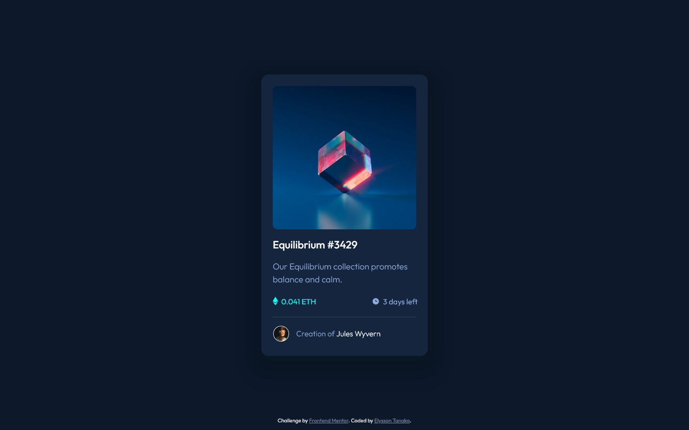

# NFT preview card component solution

This is my solution to the [NFT preview card component challenge on Frontend Mentor](https://www.frontendmentor.io/challenges/nft-preview-card-component-SbdUL_w0U).

## Table of contents

- [Overview](#overview)
  - [The challenge](#the-challenge)
  - [Screenshot](#screenshot)
  - [Links](#links)
- [My process](#my-process)
  - [Built with](#built-with)
  - [What I learned](#what-i-learned)
- [Author](#author)


## Overview

### The challenge

Users should be able to:

- View the optimal layout depending on their device's screen size
- See hover states for interactive elements

### Screenshot




### Links

- Solution URL: [Add solution URL her](https://your-solution-url.com) add the solution from FEM
- Live Site URL: [NFT Preview Card Component](https://elyssontanaka.github.io/2_nft_preview_card_component/)


## My process

### Built with

- Semantic HTML5 markup
- CSS custom properties
- Flexbox
- Desktop-first workflow


### What I learned

In this project I was able to practice some CSS concepts as positioning(relative, absolute), display(flex, inline-block) and how to use them to achieve the expected result. One challenge for me in this project was to be able to hover one element and affect the element's child at the same time. In addition, I had to use ::after to change the element's background, adding a extra layer of color to the background image when on hover state. That is something I learned and will bring it with me to the next projects. :)


```html
    <section class="image-container">
      
    </section>
```
```css
.image-container {
    margin: 24px 24px 0 24px;
    background: url("/images/image-equilibrium.jpg");
    background-size: cover;
    height: 300px;
    border-radius: 10px;
    position: relative;
    cursor: pointer;
}

.image-container::after {
    content: '';
    /* it only shows with position absolute */
    position: absolute;
    background: rgba(0, 255, 247, 0.5);
    width: 300px;
    height: 300px;
    visibility: hidden;
    border-radius: 10px;
}

.image-container:hover::after {
    visibility: visible;
}

.image-container:hover .eye-icon {
    visibility: visible;
    z-index: 1000;
}

.eye-icon {
    width: 47px;
    position: absolute;
    left: 50%;
    top: 50%;
    transform: translate(-50%, -50%);
    visibility: hidden;
}
```

## Author

- Portfolio Website - [Elysson Tanaka](https://elyssontanaka.github.io)
- Frontend Mentor - [@elyssontanaka](https://www.frontendmentor.io/profile/elyssontanaka)